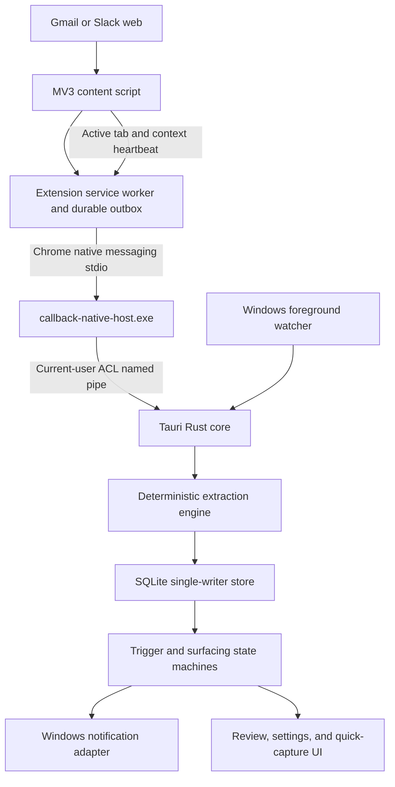

# Callback Windows-First V1 Plan

## Goal and scope

- Use [callback-spec.md](callback-spec.md) as the product source, with the technical corrections below.
- Deliver Windows first. Keep platform boundaries for future macOS and Linux implementations.
- Implement Phase 0, Phase 1, and Phase 2 sequentially. Do not begin the next phase until its kill gate passes.
- Exclude mobile, accounts, cloud sync, servers, calendar/email sending, team task management, local LLM extraction, and non-Chrome browsers from v1.
- Define “local-only” precisely: Callback runtime opens no TCP/UDP listener and transmits no message content. Chrome Store/package-manager traffic is outside the runtime guarantee.

## Corrections to the source spec

- Chrome launches a native messaging host as a separate process. Add a small `callback-native-host.exe`; do not embed the stdio loop in the Tauri GUI process.
- Correct native-message limits: host-to-Chrome is 1 MiB; Chrome-to-host is 64 MiB. Use 32-bit native-endian framing and Windows binary stdio.
- Add the required extension manifest `version`. Keep `key` to preserve the extension ID during development, but describe it as operationally required for stable `allowed_origins`, not mandatory in every extension.
- Do not infer Gmail, Slack, or a DM from `chrome.exe`. Combine Windows foreground events with extension-reported active-tab, visibility, and context events.
- Support Gmail web and Slack web only in v1. Slack desktop capture is not covered by the browser extension.
- Treat Gmail and Slack DOM structures as unsupported, changeable contracts. Confirm a send before persistence, externalize selectors from day one, and maintain content-free health probes.
- Let Windows enforce OS DND. Callback owns durable quiet hours and never bypasses DND with an always-on-top card.
- Package managers do not eliminate SmartScreen risk. Record unsigned-binary warnings as a launch risk.
- Make the global shortcut open a quick-capture window. Do not claim it can silently read arbitrary selected text.

## Architecture

- Keep one long-lived Tauri process and one logical SQLite writer. The native host authenticates the extension origin, validates a versioned protocol, and forwards envelopes over a per-user named pipe.
- Persist an extension outbox in `chrome.storage.local`. Remove an item only after the core commits it and returns an acknowledgement.
- Use stable `capture_id` plus `clause_ordinal` for retry-safe capture. Use transactional leases and action tokens for retry-safe surfacing.
- Define explicit state machines for connection, promise, surface attempt, and selector health.

## Key decisions

- KTD1. Use a Cargo workspace with a Tauri app and a dedicated native-host binary. This matches Chrome’s process model and prevents stdout corruption.
- KTD2. Use React and TypeScript for the Tauri UI and extension code, with shared protocol types generated or mirrored from a versioned JSON schema.
- KTD3. Keep all database writes in the Tauri core over a current-user-only named pipe. Enable WAL, busy timeout, and `PRAGMA foreign_keys=ON` on every connection.
- KTD4. Use deterministic heuristics first. Store low-confidence clauses only in review mode and create no triggers until promotion.
- KTD5. Treat a web context as focused only when Chrome is foreground and the extension reports the matching visible active tab/context. Restart the five-second dwell on every relevant transition.
- KTD6. Use native Windows toasts for surfacing and a normal Tauri window for review/settings. Put notifications behind a `NotificationSink`; verify installed-build and cold-start actions before committing to the Tauri plugin implementation.
- KTD7. Enforce app quiet hours locally and let Windows handle DND. Never burst a suppressed backlog; re-evaluate one candidate after a new eligible focus transition.
- KTD8. Use UTC for stored instants, preserve the local timezone/precision used to parse deadlines, and define EOD/EOW with a small explicit lexicon around the chosen parser.

## Implementation units

### U1. Correct the contract and scaffold the workspace

- **Files:** [callback-spec.md](callback-spec.md), [Cargo.toml](Cargo.toml), [package.json](package.json), [src-tauri/Cargo.toml](src-tauri/Cargo.toml), [src-tauri/src/lib.rs](src-tauri/src/lib.rs), [src-tauri/tauri.conf.json](src-tauri/tauri.conf.json), [extension/manifest.json](extension/manifest.json), [.gitignore](.gitignore), [LICENSE](LICENSE)
- **Work:** Record the corrections above, scaffold Tauri v2/React/TypeScript, establish Rust/TypeScript formatting and linting, add Windows-first feature gates, and create no-op macOS/Linux platform adapters.
- **Tests:** Clean install, dev startup, release build, manifest validation, platform-gated compilation, and no unexpected runtime listener.

### U2. Implement durable storage and domain state

- **Files:** [src-tauri/migrations/0001_initial.sql](src-tauri/migrations/0001_initial.sql), [src-tauri/src/db/mod.rs](src-tauri/src/db/mod.rs), [src-tauri/src/domain/mod.rs](src-tauri/src/domain/mod.rs), [src-tauri/tests/schema_migration.rs](src-tauri/tests/schema_migration.rs), [src-tauri/tests/state_transitions.rs](src-tauri/tests/state_transitions.rs)
- **Work:** Replace the draft schema with constrained enums/checks, indexes, schema versioning, `capture_id` uniqueness, snooze/deadline fields, ignore counts, notification attempts, surface leases, selector health, and settings validation. Add transactional migrations and corruption/newer-schema handling.
- **Tests:** Fresh migration, repeated migration, upgrade, interrupted migration, foreign-key cascade, duplicate capture, invalid transition, concurrent read, disk-full error path, and lease recovery.

### U3. Prove Windows focus and notification delivery

- **Files:** [src-tauri/src/platform/focus/mod.rs](src-tauri/src/platform/focus/mod.rs), [src-tauri/src/platform/focus/windows.rs](src-tauri/src/platform/focus/windows.rs), [src-tauri/src/platform/notifications/mod.rs](src-tauri/src/platform/notifications/mod.rs), [src-tauri/src/platform/notifications/windows.rs](src-tauri/src/platform/notifications/windows.rs), [src-tauri/src/surfacing/debounce.rs](src-tauri/src/surfacing/debounce.rs), [src-tauri/tests/focus_debounce.rs](src-tauri/tests/focus_debounce.rs)
- **Work:** Run `SetWinEventHook` on a message-loop thread, keep callbacks minimal and reentrancy-safe, resolve process identity defensively, and implement the five-second cancellable dwell. Add the Phase 0 hardcoded reminder flow and installed-build notification action spike.
- **Tests:** Rapid alt-tab, same-app refocus, protected process lookup failure, lock/sleep/resume, stale timer cancellation, installed toast, app-stopped action activation, and single-instance behavior.
- **Kill gate:** Use Phase 0 for five days. Stop if context reminders are not materially better than time reminders.

### U4. Build the native-messaging transport

- **Files:** [crates/native-host/Cargo.toml](crates/native-host/Cargo.toml), [crates/native-host/src/main.rs](crates/native-host/src/main.rs), [crates/protocol/schema/callback-protocol.json](crates/protocol/schema/callback-protocol.json), [src-tauri/src/ipc/named_pipe.rs](src-tauri/src/ipc/named_pipe.rs), [src-tauri/src/native_host/install.rs](src-tauri/src/native_host/install.rs), [crates/native-host/tests/framing.rs](crates/native-host/tests/framing.rs), [src-tauri/tests/native_host_integration.rs](src-tauri/tests/native_host_integration.rs)
- **Work:** Implement binary stdio framing, origin/protocol handshake, input limits, content-free stderr logging, current-user pipe ACLs, reconnect/backoff, atomic host-manifest registration, and an idempotent Reconnect Extension diagnostic.
- **Tests:** Unicode, partial reads/writes, malformed/oversized frames, stdout contamination, unauthorized origin, version mismatch, main-app restart, moved install path, multiple Chrome profiles, and acknowledgement after durable commit.

### U5. Capture confirmed outgoing messages in the extension

- **Files:** [extension/src/content/gmail.ts](extension/src/content/gmail.ts), [extension/src/content/slack.ts](extension/src/content/slack.ts), [extension/src/background.ts](extension/src/background.ts), [extension/src/outbox.ts](extension/src/outbox.ts), [extension/selectors.json](extension/selectors.json), [extension/tests/capture.test.ts](extension/tests/capture.test.ts), [extension/tests/outbox.test.ts](extension/tests/outbox.test.ts)
- **Work:** Capture intent before teardown, persist only after send confirmation, deduplicate click/key paths, ignore IME/quoted/failed sends, report active tab/context/visibility, and maintain content-free selector probes. Bound the local outbox by count and bytes.
- **Tests:** Gmail compose/reply/multiple drafts/keyboard send/failed send and Slack channel/DM/thread/multiline/IME/SPA navigation/workspace switch. Test duplicate handlers, offline retry, profile isolation, selector fallback, and outbox overflow.

### U6. Implement extraction, deadline parsing, and review

- **Files:** [src-tauri/src/extraction/mod.rs](src-tauri/src/extraction/mod.rs), [src-tauri/src/extraction/deadline.rs](src-tauri/src/extraction/deadline.rs), [src-tauri/src/review/mod.rs](src-tauri/src/review/mod.rs), [src/components/ReviewQueue.tsx](src/components/ReviewQueue.tsx), [src-tauri/tests/extraction_fixtures.rs](src-tauri/tests/extraction_fixtures.rs), [src-tauri/tests/fixtures/messages.jsonl.example](src-tauri/tests/fixtures/messages.jsonl.example)
- **Work:** Implement clause segmentation, normalized scoring, hard kills, penalties, review routing, explicit blocklist learning, timezone-aware deadlines, and review actions. Keep the real labeled corpus private and local.
- **Tests:** Every signal/kill/penalty, contractions, quoted text, conditional clauses, EOD/EOW, locale/timezone/DST, multi-clause idempotency, review promotion, blocklist upsert, and no raw-body logs.
- **Kill gate:** Label 300 real sent messages. Require at least 70% precision before Phase 2 and target at least 80% before release.

### U7. Close the trigger and surfacing loop

- **Files:** [src-tauri/src/triggers/mod.rs](src-tauri/src/triggers/mod.rs), [src-tauri/src/surfacing/mod.rs](src-tauri/src/surfacing/mod.rs), [src-tauri/src/surfacing/rate_limit.rs](src-tauri/src/surfacing/rate_limit.rs), [src-tauri/src/surfacing/actions.rs](src-tauri/src/surfacing/actions.rs), [src/components/Settings.tsx](src/components/Settings.tsx), [src-tauri/tests/trigger_matching.rs](src-tauri/tests/trigger_matching.rs), [src-tauri/tests/surfacing_policy.rs](src-tauri/tests/surfacing_policy.rs)
- **Work:** Auto-link context and app fallbacks, combine browser/OS focus, enforce one active surface, deterministic selection, daily and rolling caps, 90-minute gap, snooze, one deadline escalation, explicit ignore counting, auto-archive, app quiet hours, and crash-safe action callbacks.
- **Tests:** Context versus app fallback, stale heartbeat, browser foreground without matching tab, competing promises, timezone/day rollover, clock rollback, suppressed candidates, no backlog burst, snooze requiring a new focus transition, duplicate/late actions, restart recovery, and three explicit ignores.
- **Kill gate:** Use the closed loop daily for two weeks. Require at least 40% actionable acceptance before launch work.

### U8. Onboarding, health, privacy, and Windows distribution

- **Files:** [src/components/Onboarding.tsx](src/components/Onboarding.tsx), [src/components/HealthStatus.tsx](src/components/HealthStatus.tsx), [src-tauri/src/health/mod.rs](src-tauri/src/health/mod.rs), [src-tauri/src/purge.rs](src-tauri/src/purge.rs), [.github/workflows/ci-windows.yml](.github/workflows/ci-windows.yml), [docs/privacy.md](docs/privacy.md), [README.md](README.md)
- **Work:** Add idempotent onboarding, handshake diagnostics, autostart disclosure, 30-minute silence from onboarding completion, selector-health banners based on failed probes, configurable quick capture, data retention/purge, Windows CI, package artifacts, and truthful privacy/SmartScreen documentation.
- **Tests:** Extension-first/app-first install, reinstall, upgrade path move, reconnect states, shortcut collision, quiet-hours settings, retained-data prompt, purge/unregister, installed-build smoke test, and runtime network/listener audit.

## Verification contract

- Rust: format, lint with warnings denied, unit/integration tests, and Windows release build.
- TypeScript: type-check, lint, extension unit tests, and production bundles for app and extension.
- Protocol: framing fuzz/property tests plus app-host-extension acknowledgement integration tests.
- Data: migration matrix, foreign-key check, idempotency, restart recovery, and backup/restore smoke test.
- Windows: installed-build focus watcher, cold notification actions, lock/sleep, DND/Focus Assist behavior, autostart, native-host registry, and package-manager install/uninstall.
- Privacy: verify no Callback-owned TCP/UDP listener, no message-body logs, no `storage.sync`, no runtime update fetch for selectors, and no telemetry dependency.
- Manual canary: repeat the Gmail and Slack matrix after every selector change; the DOM is not a stable API.

## Definition of done

- All unit tests, integration tests, lints, type checks, and the Windows installed-build matrix pass.
- The native protocol is versioned, bounded, origin-checked, retry-safe, and produces no stdout outside framed messages.
- Capture, surface, snooze, completion, rejection, and restart flows are durable and idempotent.
- Callback opens no network listener and does not transmit captured content.
- Phase 0, extraction precision, and two-week acceptance kill gates pass with recorded local results.
- Windows onboarding, reconnect, diagnostics, purge, and unsigned-binary disclosures are complete.
- macOS/Linux remain compile-safe extension points, not claimed v1 functionality.

## Research anchors

- [Chrome native messaging](https://developer.chrome.com/docs/extensions/develop/concepts/native-messaging)
- [Chrome manifest key](https://developer.chrome.com/docs/extensions/reference/manifest/key)
- [Windows SetWinEventHook](https://learn.microsoft.com/en-us/windows/win32/api/winuser/nf-winuser-setwineventhook)
- [Tauri notifications](https://v2.tauri.app/plugin/notification/)
- [SQLite foreign keys](https://sqlite.org/foreignkeys.html)

