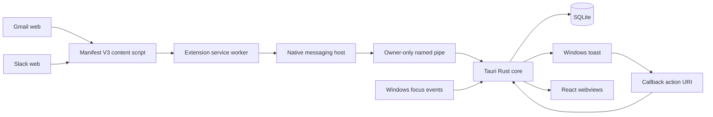
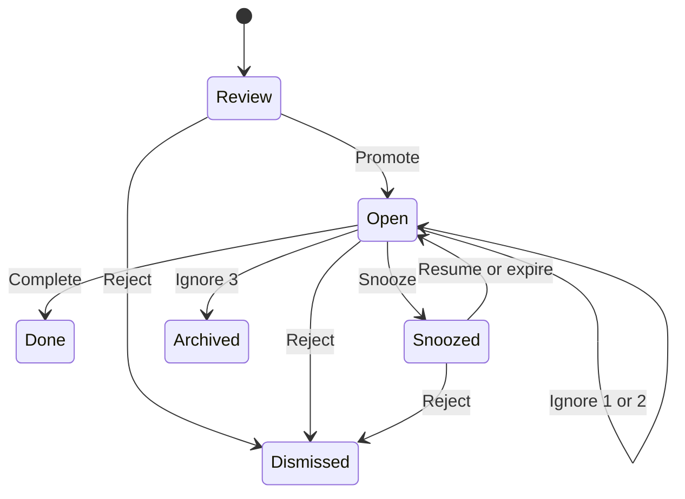

---
meta:
  title: Explain how Callback works
  navLabel: Architecture
  category: Project
  contentType: Conceptual
  plan: ./documentation-plan.md
---

# Explain how Callback works

Callback combines browser capture, native Windows context, durable local state, and operating-system notifications without adding a remote content service. This page explains process boundaries, runtime flows, state transitions, idempotency, and trust assumptions.

## Follow the runtime topology

Five process roles participate in the installed Windows system:

The roles are:

- **Content scripts**: resolve a compose-scoped outgoing message and wait for send confirmation
- **Extension service worker**: stores retries, applies source policy, reports context, and owns Chrome native messaging
- **Native host**: validates the extension origin and bridges framed standard input and output to a named pipe
- **Tauri desktop process**: owns database writes, focus matching, extraction, surfacing, notifications, settings, and UI commands
- **Purge helper mode**: waits for the desktop process to exit before deleting files and current-user registrations

The app uses two React webviews. `main` hosts the desktop shell. `quick` renders the `?window=quick` manual-capture mode.

## Start the desktop runtime in a defined order

`src-tauri/src/main.rs` parses two launch modes. `--purge` runs cleanup. Normal startup accepts at most one strict `callback-action://` activation before calling `run_with_activation`.

`src-tauri/src/lib.rs` then performs this sequence:

1. Install single-instance and global-shortcut plugins
2. Initialize the selected platform adapter
3. Resolve the Tauri application-data directory
4. Open `callback.db`, check integrity, and apply migrations
5. Locate the sibling native-host executable
6. Rewrite and register the Chrome native-host manifest
7. Seed a valid Internet Assigned Numbers Authority (IANA) timezone when absent
8. Run retention and recover expired notification leases
9. Reconcile the current-user autostart setting
10. Start the owner-only named-pipe server
11. Start the focus and surfacing worker
12. Start the 24-hour retention worker
13. Publish `AppState` to Tauri commands
14. Redeem cold-start or setup-time notification activations
15. Install the tray and register primary or fallback shortcuts
16. Register the Tauri command handler and enter the event loop

Native-host registration failure logs a content-free warning but does not stop the desktop. Health can retry registration later.

The background workers do not have an explicit shutdown and join path. Process exit terminates them.

Closing the `main` window prevents process exit and hides Callback so capture, focus, surfacing, and retention workers remain resident. The tray's **Open** action or a tray click restores and focuses Main. **Quit** exits the process. Auxiliary windows, including Quick capture, keep normal close behavior.

## Capture only after send confirmation

The browser path separates send intent from durable capture. This prevents failed or cancelled sends from entering Callback.

### Record a local send intent

The content script listens for supported click and keyboard gestures only while the desktop-provided site policy enables the current site. It resolves one composer, extracts authored text from a cloned node, removes quoted content, and asks `extension/src/capture.ts` whether the intent is eligible.

The intent layer rejects:

- Empty authored text
- Input Method Editor composition
- A pending or recently confirmed duplicate from the same source, composer, context, recipient, and text
- Ambiguous Slack composer scope

No body leaves the content script at this stage.

### Confirm the site completed the send

Gmail requires compose completion and a matching success mutation. Slack requires the scoped editor to stay empty for 250 ms. Both paths fail after 10 seconds.

A failed confirmation removes the short dedupe record and emits no capture. After confirmation, the content script sends the local intent key and fields to the service worker.

### Commit through a durable outbox

The service worker creates a stable capture identifier and stores the record in `chrome.storage.local`. The outbox serializes mutations and enforces both limits:

- 500 records
- 5 MiB total encoded body bytes

It drops oldest records to stay within bounds. The service worker retains each record until the core acknowledges either committed storage or terminal discard.

### Cross the native transport

Chrome launches `callback-native-host.exe` and passes the extension origin. The host:

1. Normalizes and compares the origin with the pinned allowlist
2. Reads one native-endian length-prefixed JSON frame
3. Validates protocol version `1`
4. Logs envelope kind, identifier, and direction for accepted envelopes
5. Forwards the original frame to the local named pipe
6. Requires an acknowledgment (`Ack`) or `Error` response
7. Writes only a valid framed response to Chrome standard output

Chrome-to-host framing allows 64 MiB. Host-to-Chrome framing allows 1 MiB. The core limits a capture body to 5 MiB. Fatal protocol or transport failures log their error string to standard error and can include a rejected origin; standard output remains framed-only.

### Validate and persist atomically

`src-tauri/src/ipc/commit.rs` accepts Gmail or Slack captures only when:

- Envelope and capture identifiers match
- The identifier and body are nonempty
- The timestamp is positive and supported
- The source is known and currently enabled
- The configured timezone is valid
- The body stays within its limit

`src-tauri/src/review` extracts clauses, fingerprints canonical payload fields, prepares triggers, and calls one database transaction. That transaction writes the receipt, captures, promises, deadlines, triggers, and selector health together.

The acknowledgement returns after commit. An exact retry reports the existing outcome. Changed content under the same identifier returns a conflict.

## Combine Windows focus with fresh browser context

Application focus and browser route are distinct signals. Callback never infers a Gmail or Slack page from `chrome.exe` alone.

### Observe Windows transitions

`src-tauri/src/platform/focus/sys_windows.rs` installs:

- A foreground WinEvent hook
- A hidden nonactivating window
- Windows Terminal Services lock and unlock notifications
- Power suspend and resume notifications

Native callbacks perform bounded `try_send` operations. They do not resolve process details inside the callback.

The resolver opens processes with limited query rights and reads their image. Protected, exited, or inaccessible processes produce no target and cancel the pending dwell.

### Maintain browser context

The extension reports source, route, visibility, and focus. The service worker forwards context only for an enabled source from a matching active tab.

The desktop keeps one context in memory with its receipt time. `combine_live_focus` uses it only when:

- The foreground executable is Chrome
- The context reports visible and active
- The context is no older than 15 seconds

A changed browser context signals the focus worker and restarts dwell evaluation.

### Require continuous dwell

`FocusDebouncer` tracks a target and monotonic generation. A target becomes eligible only after five seconds of continuous focus.

Foreground changes, lock, unlock, sleep, resume, and missing process identity invalidate prior generations. Unlock and resume sample the current foreground process before starting a new dwell.

## Select one reminder at a time

`src-tauri/src/surfacing/engine.rs` evaluates a completed dwell in a strict order.

1. Clear any due-snooze marker because a fresh dwell has completed
2. Check whether extraction evidence passed
3. Match and select one extracted promise when enabled
4. Apply extracted-reminder policy
5. Deliver or suppress that extracted candidate
6. Try an enabled Phase 0 rule only when no extracted candidate produced a result

A policy-suppressed extracted candidate stops the flow. Phase 0 does not become a fallback for the same dwell.

### Select extracted candidates deterministically

Trigger matching maps current context to stored rows:

- Exact web context: priority 100
- Source application: priority 10
- Keyword executable: priority 5
- Manual marker: priority 0 and never focus-matchable

Multiple trigger rows for one promise collapse to their highest matching priority. Candidate ordering then uses:

1. Earliest deadline
2. Highest extraction confidence
3. Oldest creation time
4. Highest matching trigger priority

This ordering produces one winner and prevents notification bursts.

### Enforce extracted-reminder policy

The rate limiter checks persisted state before delivery:

- No other unacted notification remains active
- The same promise has not surfaced on the local day
- The daily cap has not been reached
- The minimum gap has elapsed
- Quiet hours are inactive
- Onboarding silence has ended
- The clock has not moved backward by more than five minutes

The configured timezone defines local-day accounting. Quiet-hour wall-clock evaluation currently depends on machine-local time, which can diverge from the configured timezone.

### Escalate one unseen deadline

The maintenance worker waits at least one second between passes. It reopens due snoozes and selects at most one overdue promise that has never surfaced and has no prior deadline escalation.

A due snooze retains a marker until a fresh focus dwell clears it. A successful deadline notification records its one-time escalation. A policy-suppressed deadline remains eligible for a later maintenance pass.

## Deliver generic actionable notifications

Extracted reminders never put captured clause text into Windows notification history. `NotificationRequest::actionable` uses:

- Title: `Callback`
- Body: `A reminder is ready in Callback.`
- Actions: Open, Done, Snooze, Not a promise, and Ignore

Phase 0 notifications differ because they display the reminder text the operator entered.

### Lease before calling Windows

Before calling the notification sink, the core creates:

- A surface-attempt row
- A notification-attempt row
- A lease token
- An action token
- A 15-minute expiry

A successful sink call marks delivery and shown state together. A failed call records a bounded error and expires the lease. Startup recovers attempts that outlived their expiry without a final result.

### Redeem actions exactly once

An action URI contains a canonical action token rather than promise content. The core looks up the lease and atomically:

- Rejects unknown, duplicate, late, or expired tokens
- Applies the domain transition
- Stores the action and acted timestamp
- Updates ignore count or snooze time
- Learns a blocklist skeleton after Not a promise

A toast Snooze action uses one hour. Promise Detail can supply another future timestamp through the same state rules.

### Route an opened promise to React

After validation, the lifecycle layer queues `{route_id, promise_id}` and emits `promise-route-ready`. The main webview peeks without consuming, opens the matching promise, and acknowledges the current queue head.

The route carries no title, message body, source context, process identifier, or window information.

## Apply explicit promise transitions

`src-tauri/src/domain/mod.rs` defines legal status changes:

Done, Dismissed, and Archived are terminal in the current UI. Direct edits and actions include expected status and ignore count, so a stale snapshot cannot overwrite a newer transition.

## Serialize durable state

`Database` owns one SQLite writer connection behind a mutex. Tauri `AppState` wraps it in a shared mutex, which serializes runtime access at the application boundary. A short-lived write-ahead-log reader helper exists for tests. Current runtime commands, including diagnostics, use the serialized writer path.

Every connection applies:

- Write-ahead logging
- Foreign keys
- A 5,000 ms busy timeout
- `synchronous=NORMAL`

Startup rejects a newer schema, detects corruption through `PRAGMA integrity_check`, and applies each migration inside `BEGIN IMMEDIATE`. `user_version` advances only after a migration succeeds.

### Preserve idempotency at each boundary

Different identifiers protect different operations:

| Boundary       | Durable identity                    | Result                                  |
| -------------- | ----------------------------------- | --------------------------------------- |
| Browser send   | `cap-intent_key`                    | Stable extension retries                |
| Capture commit | Capture ID plus SHA-256 fingerprint | Exact retry or conflict                 |
| Promise clause | Capture ID plus clause ordinal      | Stable extracted rows                   |
| Notification   | Surface lease plus action token     | One active delivery and one action      |
| React route    | Route ID plus activation-key cache  | FIFO handling and duplicate suppression |

The first four identities survive process restart. The React route queue does not.

## Enforce trust and privacy boundaries

Callback has several local trust boundaries rather than one global authentication layer.

### Browser boundary

The manifest limits site access to Gmail and Slack. The service worker validates the sender tab hostname and site policy. The native host validates the pinned extension origin.

A compromised allowed page can still influence its content script. Compose scoping, send confirmation, input limits, and core validation reduce accidental or malformed capture.

### Named-pipe boundary

The pipe uses protected owner-only access-control language. Another Windows account cannot connect. A malicious process under the same account can connect directly, so this boundary is user isolation rather than process authentication.

### Webview boundary

The content security policy limits content and network sources to self and Tauri inter-process communication. Some sensitive commands verify the `main` label. Other commands trust any Callback webview with command access.

### Storage boundary

SQLite and the extension outbox remain local but are not encrypted. Operating-system account and disk protections provide confidentiality. Retention and purge reduce duration, not initial visibility to the account owner or local malware.

### Notification boundary

Extracted notifications use generic copy. Focus-rule notifications contain explicit operator-authored text and can appear in Action Center or on the lock screen.

Read [`privacy.md`](privacy.md) for the supported contract and exclusions.

## Recover from expected failures

The system favors durable retries and fail-closed behavior:

- **Chrome or host unavailable**: keep enabled-source captures in the outbox
- **Desktop unavailable**: the host exits after bounded connection attempts; a later worker wake reconnects
- **Duplicate capture**: return the existing receipt outcome
- **Changed duplicate**: reject with a conflict
- **Disabled source**: return terminal discard and remove source outbox items
- **Database write failure**: roll back the complete capture write set
- **Notification delivery failure**: expire the lease and retain a bounded local error
- **Process restart**: recover expired leases, rerun retention, and re-register the host
- **Lock or sleep**: invalidate pending dwell and require a fresh target
- **Stale Promise Detail**: reject the mutation and request refresh
- **Selector miss**: record content-free degraded or broken health

The design does not silently switch to a remote service.

## Treat non-Windows adapters as unsupported

The platform boundary exposes focus, notification, named-pipe, and autostart interfaces. Default Windows builds use real implementations.

Non-Windows builds use no-op or in-memory adapters. They can compile selected code paths but do not provide equivalent capture transport, foreground focus, visible notifications, or autostart. Do not describe them as supported runtimes.
